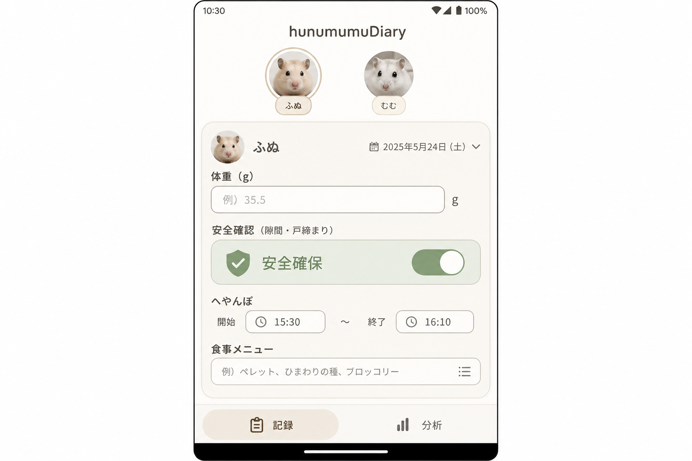
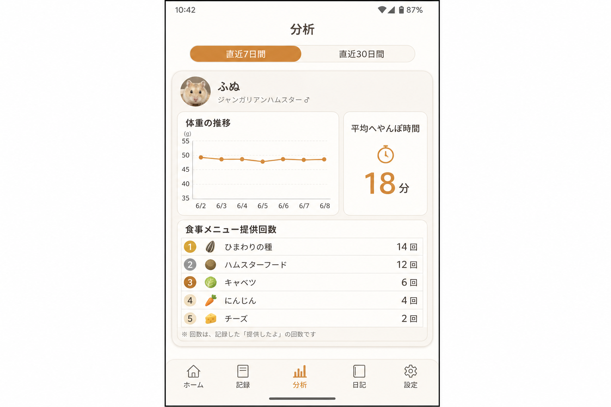
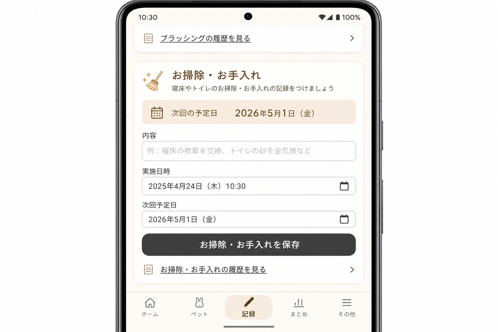

# Project Withham

ハムスター **ふぬ** と **むむ** の日々を記録・分析する、Android 向け飼育記録アプリ。
体重・へやんぽ・食事・安全確認・お手入れを端末ローカル（SQLite）で完結管理し、7日 / 30日の集計とグラフで可視化します。

> 個人開発を約1年継続（2025〜）。Web UI 試作（v1）から React Native / Expo によるモバイルアプリ（v2）へ移行した、設計の変遷を含むプロジェクトです。

---

## withham-health（メインアプリ / Android・Expo）

| 記録 | 分析 | お手入れ |
|---|---|---|
|  |  |  |

- **記録** — 体重・安全確認・へやんぽ・食事・メモ・お掃除をブロック単位で独立保存
- **分析** — 体重推移グラフ、平均へやんぽ時間、食事提供回数（7日 / 30日切替）
- **オフライン動作** — データは端末内 SQLite に永続化
- 個体は左右スワイプで切替

**技術スタック:** Expo SDK 54 / React Native 0.81 / expo-sqlite / React Navigation / react-native-chart-kit / EAS Build（APK）

詳細なセットアップ・画面説明・ビルド手順 → **[withham-health/README.md](withham-health/README.md)**

---

## アーカイブ: v1 UI（React + Vite + Tailwind）

初期の Web 版 UI 試作。再利用可能な UI 資産を `withham_front/withham-frontend/` に保管しています。

```bash
cd withham_front/withham-frontend
npm install
npm run dev
```

> v1 の Python バックエンドは本リポジトリから除去済みです。現行の開発対象は上記 withham-health です。
